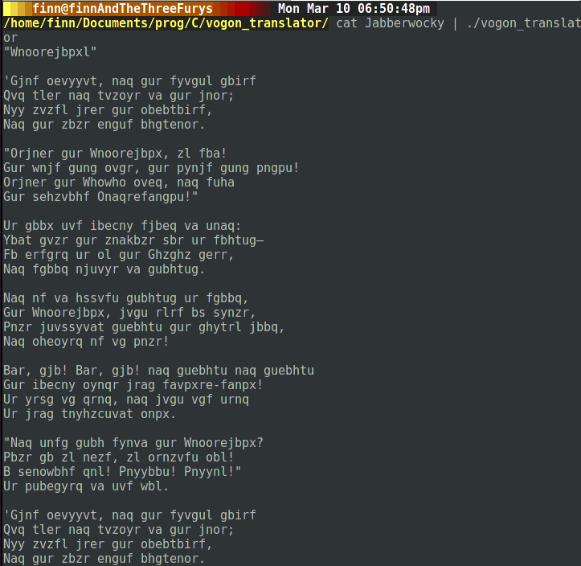

Hey! 
First off, this is licensed under the GPLv2, you can find a copy of it in the 
file calld LICENSE.

Second off, you could easily change this to take an argument of the offset 
to make it a proper Caesar Cypher.

Usage:
`echo WOOP | ./vogon_translator`
and 
`./vogon_translator "WOOP"`
are the same.

Piping the input in is preferred, however, as you can then do:
`cat Jabberwocky | ./vogon_translator`
the rest is self explanatory :)

I've included Jabberwocky so that you can try this for yourself :)

This requires unistd.h to run, although the compiled version should work on 
any Linux box just fine.

NB: Sorry for the horrible coding, I made this at about 2:00 -> 3:00 with no 
caffiene. 

- Galle

PS: Have a screenshot:

